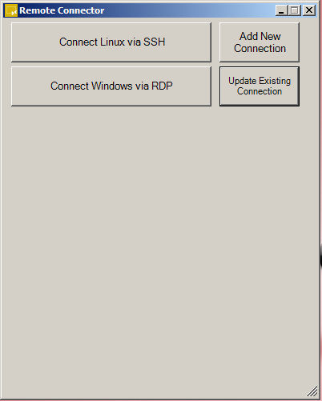

# RemoteConnectPS
This is a very Simple Program to remotely connect Windows machine via MSTSC or *nix systems via Putty (SSH).
It Uses SQLite as database to store remote IPAddress, Credentials and uses windows forms for basic GUI

**Note: It works on only Windows which has Powershell version 3.0 or above**

# Installing
**Requirement: Windows OS with Powershell 3.0 or above**

1. First download PSSqlite Module and Install it either using Install-Module PSSQLite or Download it from "https://github.com/RamblingCookieMonster/PSSQLite", extract the PSSQLite folder to a module path (e.g. $env:USERPROFILE\Documents\WindowsPowerShell\Modules\)
1. Download putty.exe from "https://www.chiark.greenend.org.uk/~sgtatham/putty/latest.html" and place it in RemoteConnectPS folder
1. Now just Run run.bat file

Troubleshooting: if the scripts are blocked kindly run **set-executionpolicy unrestricted** in Powershell at administrative mode.

# Screenshot
1. ##First Screen Image

# Reference
Connect-Mstsc.ps1 was taken from https://gallery.technet.microsoft.com/scriptcenter/Connect-Mstsc-Open-RDP-2064b10b
